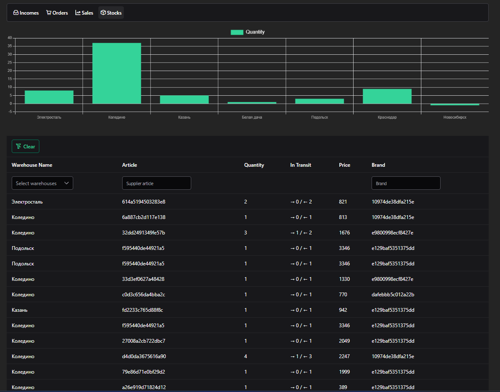

# 📊 Business Analytics Dashboard

SPA-приложение для визуализации данных по API: **incomes**, **orders**, **sales** и **stocks**.  
Проект выполнен на **Vue 3 + Composition API** с использованием UI библиотеки **PrimeVue**.

## 🚀 Возможности

- 4 страницы, соответствующие API-эндпоинтам:
  - **/incomes** — поступления
  - **/orders** — заказы
  - **/sales** — продажи
  - **/stocks** — склады
- На каждой странице:
  - 📈 график по одному из ключевых полей;
  - 🧾 таблица с данными;
  - 🔍 клиентские фильтры по полям;
  - 📄 серверная пагинация (`limit`, `offset`);
 


## 📷 Демонстрация



Попробовать проект онлайн:  
[](https://business-dashboard-one-eta.vercel.app)

## 🛠️ Технологии

| Категория | Использовано |
|------------|---------------|
| Фреймворк | [Vue 3](https://vuejs.org/) с [Composition API](https://vuejs.org/api/composition-api-setup.html) |
| UI-компоненты | [PrimeVue](https://primevue.org/) |
| Графики | [Chart.js](https://www.chartjs.org/) через PrimeVue Chart |
| Сборщик | [Vite](https://vitejs.dev/) |
| Типизация | [TypeScript](https://www.typescriptlang.org/) |
| Развёртывание | [Vercel](https://vercel.com/) |
| Форматирование кода | ESLint + Prettier |

---

## ⚙️ Установка и запуск

```bash
# 1️⃣ Клонировать репозиторий
git clone https://github.com/acidless/business-dashboard.git
cd business-dashboard

# 2️⃣ Установить зависимости
npm install

# 3️⃣ Запустить в режиме разработки
npm run dev

# 4️⃣ Собрать продакшн-сборку
npm run build
```

